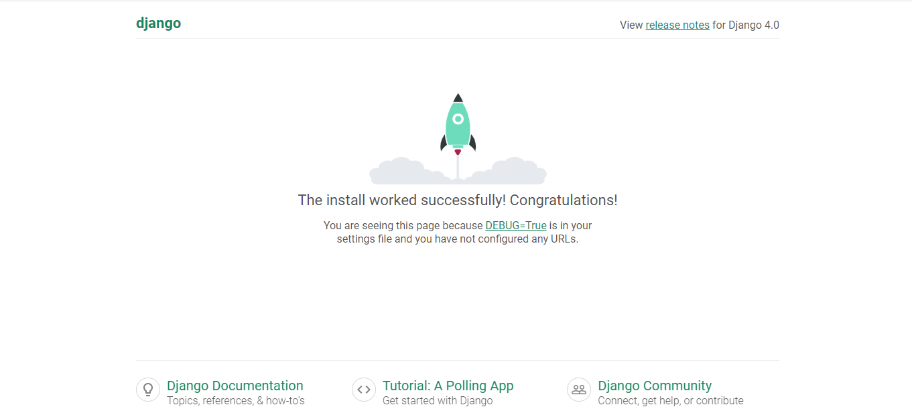

# 001 Django 4 Basic Project

## COMO RODAR ESSE PROJETO EM SEU COMPUTADOR:

### Requisitos

- **Python 3.12**  
  [Baixar Python 3.12](https://www.python.org/downloads/release/python-3122/)

  Confira o vídeo para saber como trabalhar com múltiplas versões do Python e com venv (ambiente virtual): [Trabalhando com Múltiplas Versões do Python + venv](https://youtu.be/eetDeQrv0Rs?si=rAIDmLCgdeh7ouXa)

- **Virtualenv**

  Para instalar o pacote `virtualenv` no Python, utilize os seguintes comandos:

  - **Linux**:
    ```bash
    python3 -m pip install virtualenv
    ```

  - **Windows**:
    ```bash
    python -m pip install virtualenv
    ```

### Passos para Executar

1. **Clone o repositório**:
    ```bash
    git clone https://github.com/Django-Dev-Br/001-django4-basic-project.git
    cd 001-django4-basic-project
    ```

2. **Crie e ative um ambiente virtual**:
    ```bash
    python -m venv venv312
    source venv312/bin/activate  # Linux
    venv312\Scripts\activate  # Windows
    ```

3. **Instale o Django**:
    ```bash
    pip install django==4.0
    ```

4. **Execute o servidor de desenvolvimento**:
    ```bash
    python manage.py runserver
    ```


### Acesse no seu navegador o enderço a seguir:

http://127.0.0.1:8000/


###  Após executar o servidor, você deve ver a página inicial padrão do Django, semelhante à imagem abaixo:

    

### O que é um Projeto Django?

Um projeto Django é uma coleção de configurações e aplicativos para um site web específico. Ele utiliza o framework Django, que é uma plataforma de desenvolvimento de alto nível em Python que encoraja o desenvolvimento rápido e o design limpo e pragmático. Um projeto Django contém todas as configurações necessárias para um site web, incluindo as configurações de banco de dados, configurações de segurança, configuração de aplicativos instalados e muito mais. [Mais informações na documentação oficial do Django](https://docs.djangoproject.com/).

### Estrutura de Diretórios do Projeto

```
001-django4-basic-project/
├── myproject/
│   ├── __init__.py # arquivo de pacote do python
│   ├── asgi.py # arquivo do servidor web
│   ├── settings.py # arquivo de configuração do projeto
│   ├── urls.py # arquivo de controle rotas ou requisições http
│   └── wsgi.py # arquivo do servidor web
└── manage.py
```

### Sobre Nosso Treinamento Prátic-Profissional para iniciantes e avançados

[Django Developers Brasil - Aprenda programando enquanto programa aprendendo!](https://django.dev.br/)

Nosso treinamento oferece uma experiência prática e profissional de aprendizado de programação, adequada tanto para iniciantes quanto para desenvolvedores avançados. Você participará de um projeto real de desenvolvimento de software em um ambiente corporativo autêntico, onde pessoas com diferentes níveis de conhecimento irão colaborar, aprendendo umas com as outras.

**Junte-se a nós!** E desenvolva as habilidades necessárias para o mercado de trabalho, aprimorando tanto seus conhecimentos técnicos quanto suas soft skills em um ambiente colaborativo e realista.
